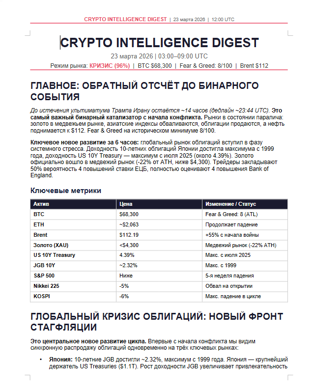

<h1 align="center">Crypto Intelligence Agent</h1>

<p align="center">
  
  
  
  
</p>

Reads your Telegram crypto channels, extracts what matters, and sends you an analyst-grade market report every 6 hours. Ask it anything — it remembers everything.

Built because reading 40+ crypto channels a day is unsustainable and most signal gets lost in noise.

<p align="center">
  
</p>

<p align="center">
  <a href="docs/example_report.pdf">See full example report (PDF)</a>
</p>

## What it does

- **Monitors** any Telegram channel or topic — just send a link to any message
- **Filters** noise from signal using Claude Sonnet as a classifier
- **Extracts** key facts, calls, and narratives into a vector database + knowledge graph
- **Reports** every 6 hours with theses, risks, and actionable insights (Claude Opus)
- **Answers** your questions about anything it has seen via `/ask`

## How it works

```
Telegram channels → Listener → Classifier (Sonnet) → mem0 (Qdrant + Neo4j)
                                                              ↓
                                              Every 6h: Analyst (Opus) → Report → You
```

## Commands

| Command | What it does |
|---------|-------------|
| `/add <link>` | Start monitoring a channel — copy link to any message in the channel or topic |
| `/remove <name>` | Stop monitoring |
| `/channels` | See what's being monitored |
| `/pause <name>` | Temporarily mute a channel |
| `/resume <name>` | Unmute |
| `/ask <question>` | Ask about anything the bot has seen |

## What you need

| | |
|---|---|
| **Server** | Ubuntu, 8 GB RAM, 2 CPU, 20 GB disk |
| **Claude** | [Pro, Max, or Teams](https://claude.ai) subscription |
| **Telegram** | Bot token from [@BotFather](https://t.me/BotFather) |
| **Voyage AI** | [Free API key](https://www.voyageai.com/) for embeddings |

<details>
<summary><b>Setup guide</b></summary>

### 1. Install Claude Code

```bash
curl -fsSL https://claude.ai/install.sh | bash
echo 'export PATH="$HOME/.local/bin:$PATH"' >> ~/.bashrc
source ~/.bashrc

# Check
claude --version
```

Log in (opens a browser link):

```bash
claude login
```

### 2. Install Docker

```bash
sudo apt-get update
sudo apt-get install -y ca-certificates curl
sudo install -m 0755 -d /etc/apt/keyrings
sudo curl -fsSL https://download.docker.com/linux/ubuntu/gpg -o /etc/apt/keyrings/docker.asc
sudo chmod a+r /etc/apt/keyrings/docker.asc
echo "deb [arch=$(dpkg --print-architecture) signed-by=/etc/apt/keyrings/docker.asc] https://download.docker.com/linux/ubuntu $(. /etc/os-release && echo "$VERSION_CODENAME") stable" | sudo tee /etc/apt/sources.list.d/docker.list > /dev/null
sudo apt-get update
sudo apt-get install -y docker-ce docker-ce-cli containerd.io docker-buildx-plugin docker-compose-plugin

# Check
docker --version
docker compose version
```

### 3. Install uv + Python

```bash
curl -LsSf https://astral.sh/uv/install.sh | sh
source ~/.bashrc
uv python install 3.12

# Check
uv --version
```

### 4. Install Node.js 22

```bash
curl -o- https://raw.githubusercontent.com/nvm-sh/nvm/v0.40.4/install.sh | bash
source ~/.bashrc
nvm install 22

# Check
node --version
```

### 5. Install screen

```bash
sudo apt-get install -y screen
```

### 6. Clone and configure

```bash
git clone https://github.com/ENbanned/info_ai_agent.git
cd info_ai_agent

cp config.json.example config.json
nano config.json
```

Save: <kbd>Ctrl</kbd>+<kbd>O</kbd>, <kbd>Enter</kbd>. Exit: <kbd>Ctrl</kbd>+<kbd>X</kbd>.

Set these three values:
- `bot.token` — bot token from @BotFather
- `bot.owner_chat_id` — your Telegram user ID (get it from [@userinfobot](https://t.me/userinfobot))
- `voyage.api_key` — API key from [voyageai.com](https://www.voyageai.com/)

> `api_id` and `api_hash` are pre-set to Telegram Desktop client values. Don't change them — Telegram treats the connection as a real desktop app, which reduces the risk of account restrictions.

### 7. Install dependencies

```bash
apt install -y build-essential
uv sync
bash mem0bot/patches/apply_patches.sh
```

### 8. Start infrastructure

```bash
docker compose up -d
sleep 60 && uv run main.py
```

Enter your phone number and verification code when prompted. Wait for `System running`, then press <kbd>Ctrl</kbd>+<kbd>C</kbd>.

### 9. Run

```bash
bash run.sh
```

Creates a service user, copies Claude credentials, and launches the bot in a screen session.

</details>

## Updating

```bash
sudo -u agent screen -S agent -X quit
git config --global --add safe.directory "$(pwd)"
git pull
uv sync
bash mem0bot/patches/apply_patches.sh
bash run.sh
```

## Logs

```bash
# Attach to the live session
sudo -u agent screen -r agent

# Detach without stopping: Ctrl+A D
```

---

<p align="center"><a href="LICENSE">MIT License</a></p>
<p align="center"><a href="https://t.me/enbanends_home">Telegram</a></p>
